# YMH - Task 2

## File structure
a) All the image files used in the project should be stored in <i>assets</i> folder <br>

b) All the components (i.e. navigation bar) should be stored in <i>components</i> folder <br>

c) All the pages for the app (i.e. home, profile, login or signup etc.) should be stored in <i>pages</i> folder <br>

d) <i>.gitignore</i> file is for specifying which files you do not want to be uploaded to GitHub. You can ignore this file for now. <br>

e) <i>App.js</i> file contains only links to the pages, so you you can ignore it as well. <br>

f) <i>README.md</i> contains project description. <br>

g) <i>app.json</i> contains metadata and configuration settings for the app, such as the app name, version, entry point, and specifics regarding the build and deployment settings, allowing developers to manage app behavior and properties in a centralized location. You can ignore it for now. <br>

h) The <i>babel.config.json</i> file is a configuration file for Babel, a JavaScript compiler, used to specify how Babel should transpile JavaScript code. It allows developers to define project-wide settings like plugins and presets to transform modern JavaScript into a version compatible with older browsers or environments. Ignore it for now. <br>

i) <i>package-lock.json</i> and <i>package.json</i> contain information about the project dependencies needed to run the app.

## Instructions
1. Install <a href="https://expo.dev/go">Expo Go</a> on your phone

2. Open the command line <br><br>
   If you are using Windows 10/11: <br>
   a. Press Win + R <br>
   b. Type <i>cmd</i> in the box that appeared in the bottom-left corner <br>
   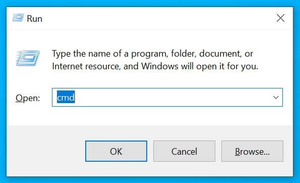
   <br>
   c. Press Enter <br>
   <br>
   If you are using MacOS: <br>
   a. Press Command + Spacebar <br>
   b. Type in <i>Terminal</i>
   c. Press Enter

3. Clone the repository using Git
   ```bash
   git clone https://github.com/Ba6ySHark/task-2.git
   ```

4. Navigate to the folder
   ```bash
   cd task-2
   ```

5. Install project dependecies from <i>package.json</i> file
   ```bash
   npm install
   ```

6. Run the existing app
   ```bash
   npx expo start
   ```

7. You will see a QR code, open the Expo Go app on your phone and scan it. <br>
   Note: your phone and computer have to be connected to the same wifi <br>
   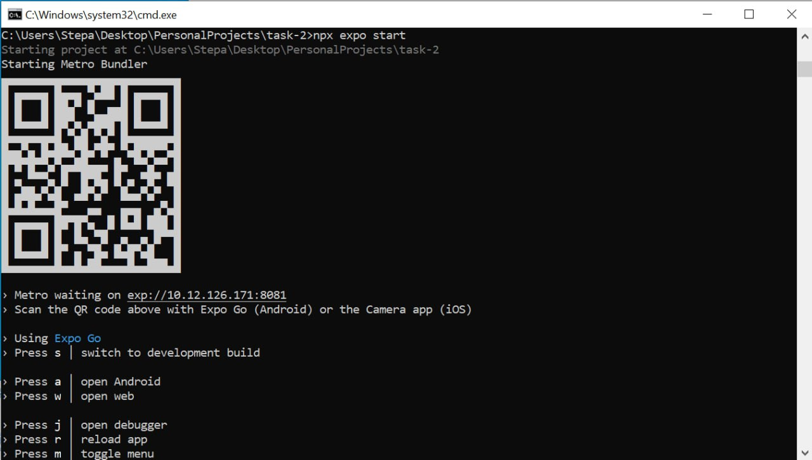

8. Open VS Code

9. Import the files you downloaded: <br>
    a. Click <i>file</i> at the top-left corner <br>
    
    b. Click <i>Open folder</i> and select the folder you downloaded <br>
    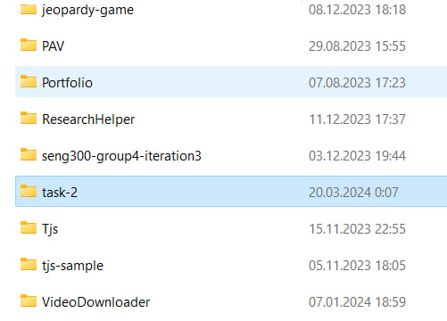

10. Navigate to the <i>pages</i> folder
    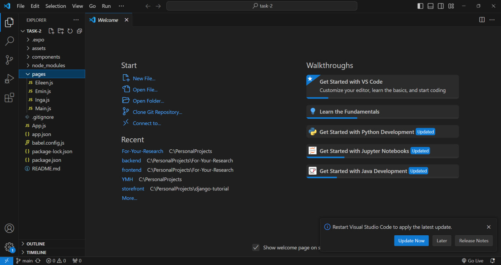

11. Find a file with your name on it and open it. I will use <i>Main.js</i>. You will see this code template:
    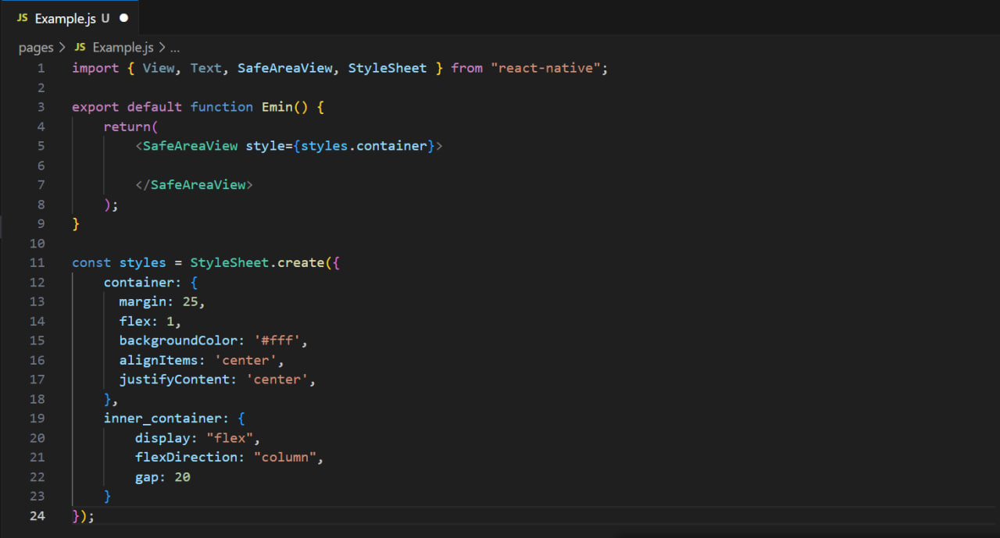

12. Add a container that will hold a label and an image. Use <i>View</i> tag for it.
    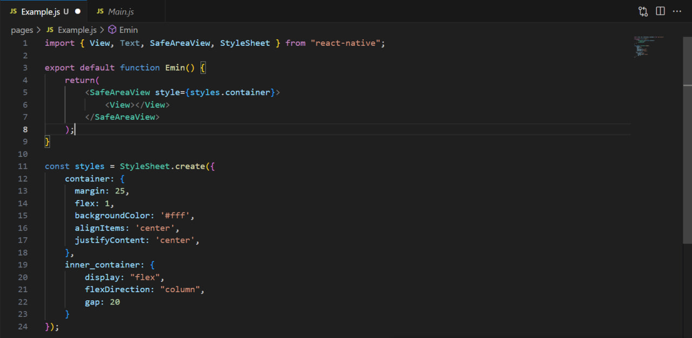

13. Add a style prop:
    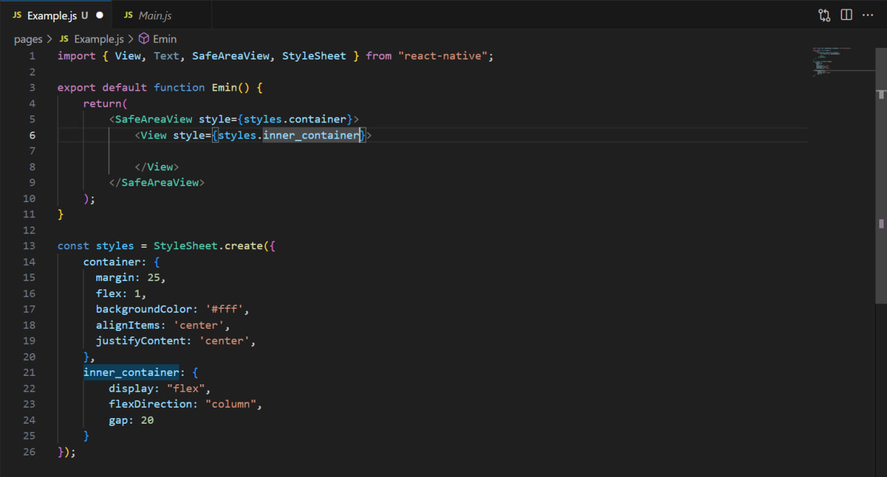

14. Add any text you want using <i>Text</i> tag:
    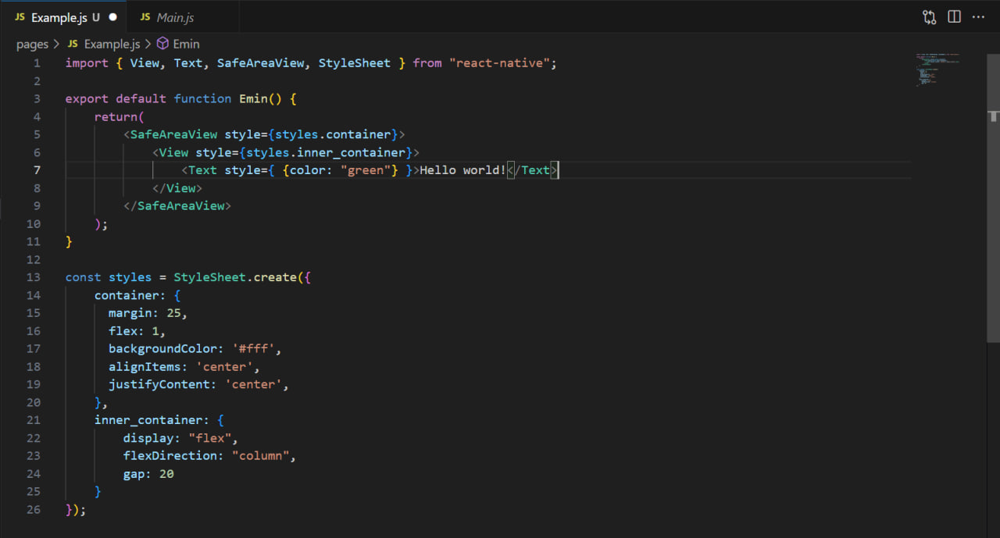

15. Find some image you like on the Internet (.jpg, .png or .gif). Move it to the <i>assets</i> folder.

16. Add it to the app using <i>Image</i> tag:
    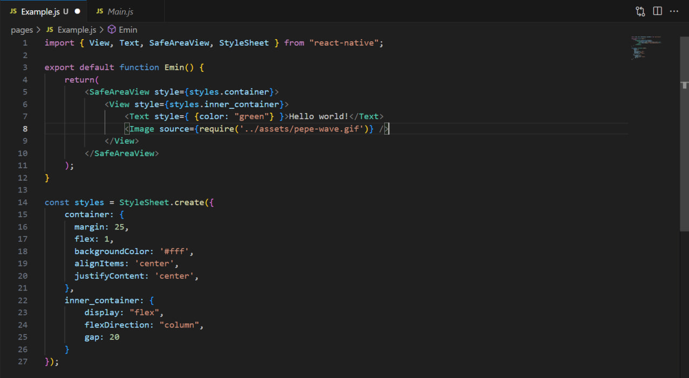

17. Press Ctrl + S to save changes (or Command + S on Mac).

18. View the changes you made on your phone: <br>
    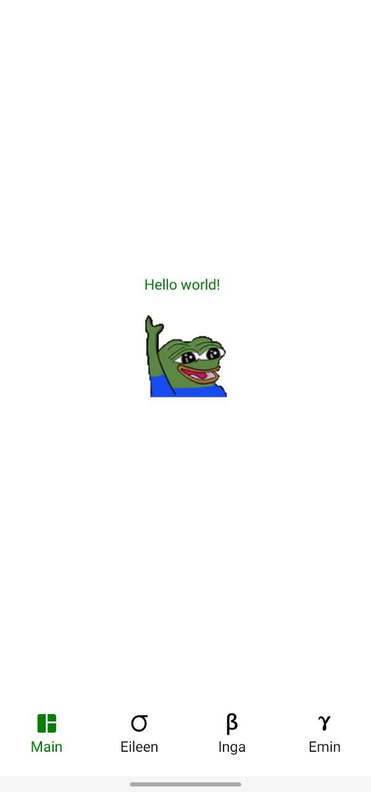

19. Navigate to the <i>cmd</i> tab you opened before.

20. Stop the server by pressing Ctrl + C
    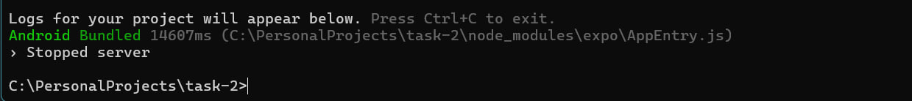

21. Check the status of the files
    ```bash
    git status
    ```
    <br>
    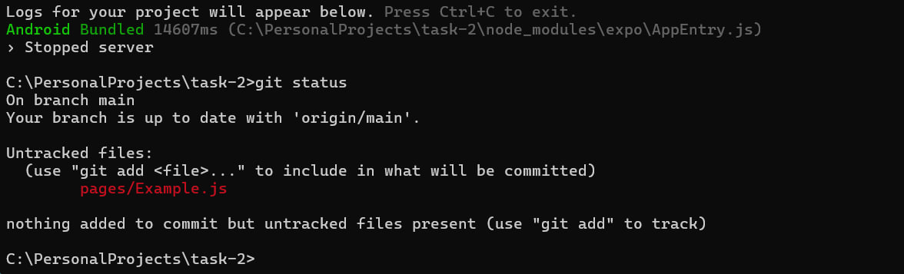

22. Add your files and commit changes
    ```bash
    git add --all
    ```

    ```bash
    git commit -m "Your comment"
    ```

23. Push the changes back to the repository for everyone to see:
    ```bash
    git push origin main:main
    ```

24. Check <a href="https://github.com/Ba6ySHark/task-2">https://github.com/Ba6ySHark/task-2</a> to see if your changes were applied.
